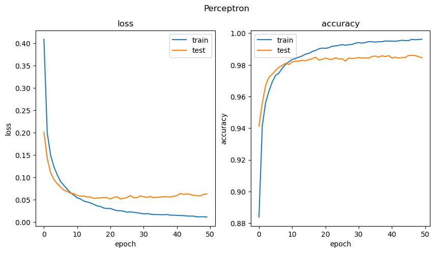
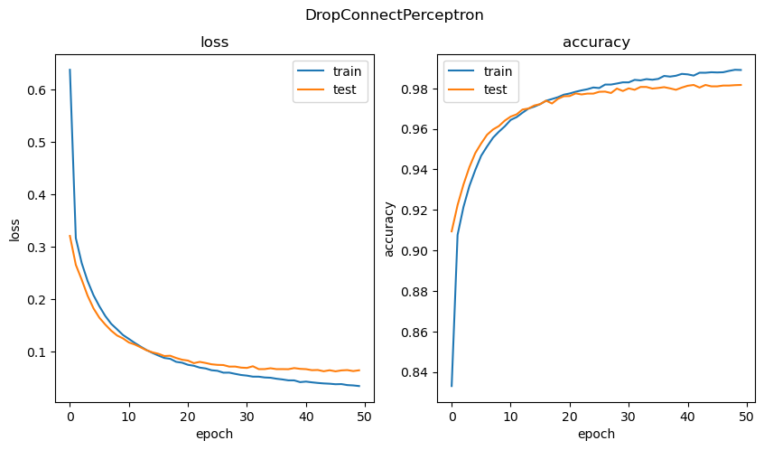

# drop-connect

The paper [DropConnect](https://cds.nyu.edu/projects/regularization-neural-networks-using-dropconnect/) introduces a regularization technique that is similar to Dropout, but instead of dropping out individual units, it drops out individual connections between units. This is done by applying a mask to the weights of the network, which is sampled from a Bernoulli distribution.

#### Donwload the paper.
Here's a link to the paper: [DropConnectPapper](https://proceedings.mlr.press/v28/wan13.html)


## Training

Let $X \in \mathbb{R}^{n \times d}$ a tensor with $n$ examples and $d$ features a $W \in \mathbb{R}^{l \times d}$ a tensor of weights.

For training, a mask matrix $M$ is created from a Bernoulli distribution to mask elements of the weight matrix $W$ , using the Hadamard product, in order to drop neuron connections instead of turning off neurons like in dropout

For a single example, the implementation is straightforward, just apply a mask $M$ to a weight tensor $W$. However, according to the paper: "A key component to successfully training with DropConnect is the selection of a different mask for each training example. Selecting a single mask for a subset of training examples, such as a mini-batch of 128 examples, does not regularize the model enough in practice."

Therefore, a mask tensor $M \in \mathbb{R}^{n \times l \times d}$ must be chosen, so the linear layer with DropConnect should be implemented as:

$$ \text{DropConnect}(X, W, M) = \begin{bmatrix}
    \begin{bmatrix}  x_1^1 & x_2^1 & \cdots & x_d^1 \end{bmatrix}
    \left(\begin{bmatrix}
        m_1^{11} & m_2^{11} & \cdots & m_d^{11} \\
        m_1^{12} & m_2^{12} & \cdots & m_d^{12} \\
        \vdots & \vdots & \ddots & \vdots \\
        m_1^{1l} & m_2^{1l} & \cdots & m_d^{1l} \\
    \end{bmatrix} \odot \begin{bmatrix}
        w_1^1 & w_2^1 & \cdots & w_d^1 \\
        w_1^2 & w_2^2 & \cdots & w_d^2 \\
        \vdots & \vdots & \ddots & \vdots \\
        w_1^l & w_2^l & \cdots & w_d^l \\
    \end{bmatrix}
    \right)^T \\
    \\
    \begin{bmatrix}  x_1^2 & x_2^2 & \cdots & x_d^2 \end{bmatrix}
    \left(\begin{bmatrix}
        m_2^{21} & m_2^{21} & \cdots & m_d^{21} \\
        m_1^{22} & m_2^{22} & \cdots & m_d^{22} \\
        \vdots & \vdots & \ddots & \vdots \\
        m_1^{2l} & m_2^{2l} & \cdots & m_d^{2l} \\
    \end{bmatrix} \odot \begin{bmatrix}
        w_1^1 & w_2^1 & \cdots & w_d^1 \\
        w_1^2 & w_2^2 & \cdots & w_d^2 \\
        \vdots & \vdots & \ddots & \vdots \\
        w_1^l & w_2^l & \cdots & w_d^l \\
    \end{bmatrix}
    \right)^T \\
    \\ \vdots   \\
    \\
    \begin{bmatrix}  x_1^n & x_2^n & \cdots & x_d^n \end{bmatrix}
    \left(\begin{bmatrix}
        m_1^{n1} & m_2^{n1} & \cdots & m_d^{n1} \\
        m_1^{n2} & m_2^{n2} & \cdots & m_d^{n2} \\
        \vdots & \vdots & \ddots & \vdots \\
        m_1^{nl} & m_2^{nl} & \cdots & m_d^{nl} \\
    \end{bmatrix} \odot \begin{bmatrix}
        w_1^1 & w_2^1 & \cdots & w_d^1 \\
        w_1^2 & w_2^2 & \cdots & w_d^2 \\
        \vdots & \vdots & \ddots & \vdots \\
        w_1^l & w_2^l & \cdots & w_d^l \\
    \end{bmatrix}
    \right)^T
\end{bmatrix} $$


### Backpropagation

In order to update the weight matrix $W$ in a DropConnect layer, the mask is applied to the gradient to update only those elements that were active in the forward pass. but this is already done by the automatic differentiation in Pytorch, since if $J$ is the gradient coming from the linear operation, the gradient propagated by the Hadamard product with respect to $W$ will be:

$$ J \odot M $$

So there is no need to implement an additional backpropagation operation, and only the Hadamard product already provided by Pytorch is needed. 

The training phase, then can be implemented as follows: 

```python
def drop_connect_training(input: Tensor, mask: Tensor, weight: Tensor, bias: Optional[Tensor] = None, bias_mask: Optional[Tensor] = None) -> Tensor:
    input = (input.unsqueeze(1)@torch.masked_fill(weight, mask, 0).transpose(1,2)).squeeze()
    if bias is not None:
        assert bias_mask is not None , "bias mask is required when bias is provided"
        input = input + torch.masked_fill(bias, bias_mask, 0)
    return input
```

## Inference

For inference, the output of the DropConnect layer should be computed as:


$$ \frac{1}{|M|} \sum_M X \cdot (M \odot W) $$

However, this is very computationally expensive, so the same paper proposes an alternative way.
Notice that the output of the linear layer applying the mask $M$ is:


$$ \sum_k X_k^i W_j^k \delta_{ii} \delta^{jj} M_i^j = \sum_k W_k^j X_i^k M_i^j \quad \text{for the $i$, $j$ element}$$

But this is a heavy sum of the elements $M_i^j$ of the Bernoulli distribution that can be approximated by a Gaussian distribution $N(\mu,\sigma^2)$ with mean:

$$ \mu_M[X] = p X W^T $$

and variance:

$$ \sigma^2_M[X] = p(1 - p) (X \odot X) (W^T \odot W^T) $$

where $p$ is the probability of the Bernoulli distribution.

Again, a single distribution is not enough, so a different distribution must be chosen for each example, and the output of the DropConnect layer should, as the paper suggests, be averaged only after the activation function.

So for models with dropconnect, batch average should be applied after the activation function.

The inference phase can be implemented then as follows: 

```python
def drop_connect_inference(input: Tensor, weight: Tensor, p: float, bias: Optional[Tensor] = None) -> Tensor:
    mean = (1-p)*linear(input, weight, bias)
    variance = p*(1-p)*linear(input**2, weight**2)
    return Normal(mean, variance.sqrt()).sample(Size([input.size(0)]))
```

### Results

At the moment, two models where trained with the MNIST dataset, a simple perceptron with a hidden layer and dropout and a dropconnect perceptron. Both trained with SGD. 

### Dropout:

```python

class Perceptron(Module):
    def __init__(self, input_features: int, hidden_dimension: int, output_features: int, p: float):
        super().__init__()
        self.flatten = Flatten()
        self.layers = Sequential(
            Linear(input_features, hidden_dimension),
            ReLU(),
            Dropout(p),
            Linear(hidden_dimension, output_features),
        )

    def forward(self, input: Tensor) -> Tensor:
        input = self.flatten(input)
        return self.layers(input)

```

### DropConnect

```python

class DropConnectPerceptron(Module):
    def __init__(self, input_features: int, hidden_dimension: int, output_features: int, p: float):
        super().__init__()
        self.flatten = Flatten()
        self.layers = Sequential(
            DropConnectLinear(input_features, hidden_dimension, p=p, max_batch_size=256),
            ReLU(),
            DropConnectBatchAverage(),
            DropConnectLinear(hidden_dimension, output_features, p=p, max_batch_size=256),
            ReLU(),
            DropConnectBatchAverage()
        )

    def forward(self, input: Tensor) -> Tensor:
        input = self.flatten(input)
        return self.layers(input)
```

Here are some results:





As you can see, the dropconnect layers reduces the overfitting of the model. You can check the code in the notebook [mnist-runs.ipynb](mnist-runs.ipynb).

The tensorboard logs are in the folder [logs](logs) and visualize them in your computer with tensorboard:

```bash
git clone https://github.com/mr-raccoon-97/drop-connect.git
cd drop-connect
pip install tensorboard
tensorboard --logdir logs/
```

Then go to [http://localhost:6006](http://localhost:6006) in your browser. Model architecture, loss, and accuracy are stored in the logs. The plots of experiments are stored automatically in the folder [plots](plots) and you can check them in the notebook.

### Contact

If you have any questions, feel free to contact me at [curious.mr.fox.97@gmail.com](mailto:curious.mr.fox.97@gmail.com)
